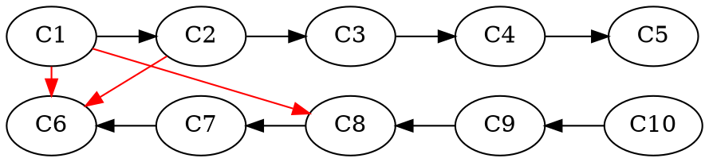
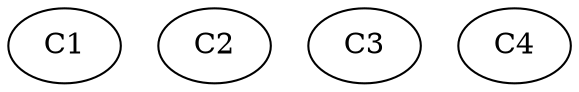

# Chung's construction projected in ZigZag

## Naive way

```graphviz
digraph G {

  rankdir="LR";
  splines=false;
  
  subgraph level1 {
      
      C1 -> C2 -> C3 -> C4 -> C5 [ weigth=1] 
      C1 -> C6 [weight=-1,color="red"]
      C2 -> C6 [weight=-1, color="red"]
      C1 -> C8 [weight=-1,color="red"]
      //C1 -> C9 [weight=-10,color="red"] 
  }
  
  subgraph level2 {
      C10 -> C9 -> C8 -> C7 -> C6 [ weigth=1]
  }
  

  
  { rank = same; C1; C6; }
  { rank = same; C2; C7; }
  { rank = same; C3; C8; }
  { rank = same; C4; C9; }
  { rank = same; C5; C10; }
  
}
```

and then 

```graphviz
 digraph G {
     rankdir="TB";
     { rank = same;"C1"; "C2"; "C3";"C4";};
 }
```
