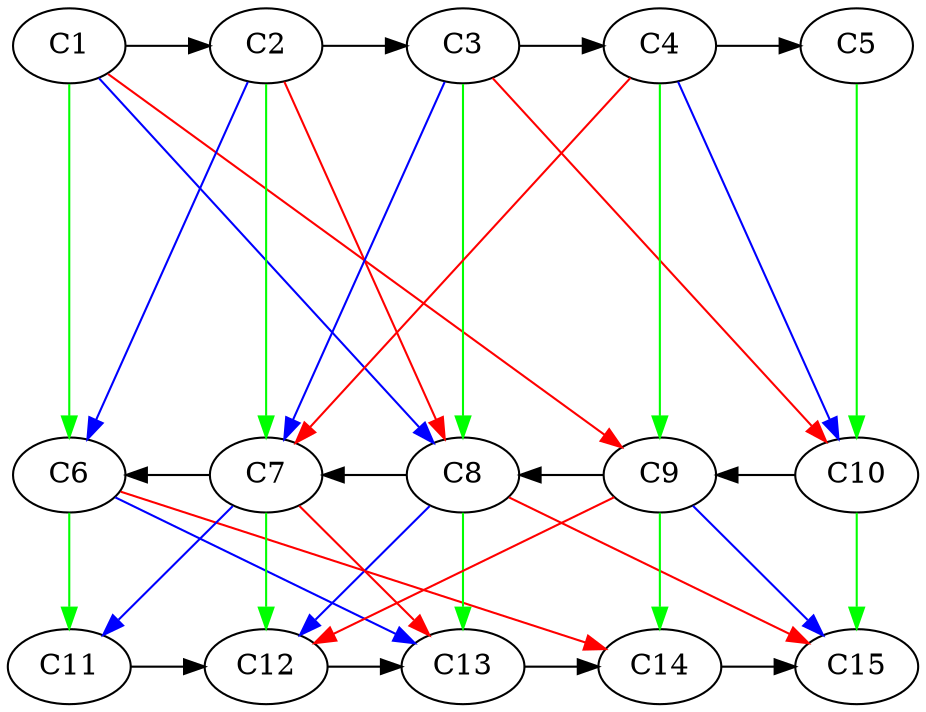
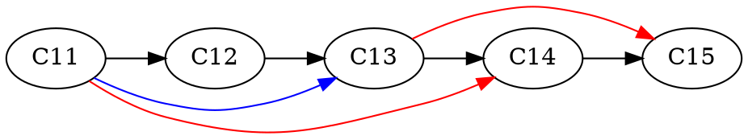
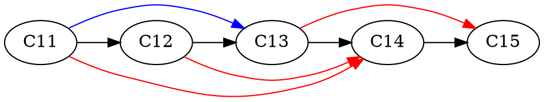

# Chung's construction projected in ZigZag

## Chung Bipartite Expander

**TODO**: color that by different colors to represent different permutatation for using the inverse


Let us work on the example from the paper but by adding the distinction between the different permutations via different colors.
Here we have $n = 5, k = 3$. 



Note that we "accept" node **C5** only has one child, for sake of clarity & consistency with the paper. 

The goal is to explore the different projections possible by looking at the **last layer** (C11 -> C15).

## Naive projection

Let us see what happens when we simply project the edges on the lower layer, rejecting the ones that are invalid. An edge $(i,j)$ is invalid at the lower layer if $i < j$. Note that the edges of the form $(i, i+1)$ is not relevant to the discussion (because always present).



We dropped the edges
+ C7 -> C11
+ C9 -> C12
+ C8 -> C12

## Projection by reversing edge

This projections add the particularity that if an edge $(i,j)$ is invalid, then it takes the inverse edge $(j,i)$. By definition, if $(i,j)$ is invalid, then $i < j$ so the edge $(j,i)$ is valid since $i > j$.



We added the edges:
+ C12 -> C14
+ 

## Projection with inverse permutation

This projection takes from option 1 but adds the following code:
```
if e = (i,j) is invalid
    e' = (j',i) # from original chung bipartite
    if e' is valid 
        add edge between c_j' to c_i
```


Compared to the last projection, we *loose* the edge $C12 -> C14$. 

This is because the edge $C9 -> C12$ projects to $C14 -> C12$ which is invalid. Therefore, the corresponding red edge from the algo is $C6->C14$, which projects to $C11 -> C14$ which is already present.

Of course this is a small example so the probability that the reverse permutation falls onto an previously set edge is negl.

**Question**: Why do we need this inverse permutation ? Why does the reversing edge is not enough ? 


